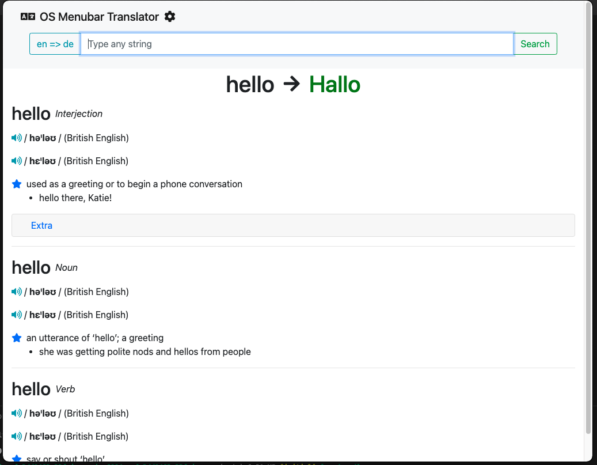

# What is this project

This is a simple translate app in your OS menubar! 

You can easily translate any word (based on **Google Translate**), and you got an **Oxford** based dictionaries as well.

## How to install
Download from [releases](https://github.com/barnabasszabo/os-menubar-english-dictionary/releases), and execute the binaries.

## How to setup
By default there is a shared demo Oxford API account, with 1000 word/month, please register yourself here: https://developer.oxforddictionaries.com/, and copy the app-id, app-key to this app! 
